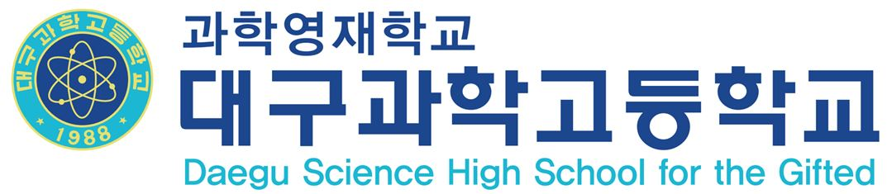

## Hi there 👋

<!--
**cheul-dshs/cheul-dshs** is a ✨ _special_ ✨ repository because its `README.md` (this file) appears on your GitHub profile.

Here are some ideas to get you started:

- 🔭 I’m currently working on ...
- 🌱 I’m currently learning ...
- 👯 I’m looking to collaborate on ...
- 🤔 I’m looking for help with ...
- 💬 Ask me about ...
- 📫 How to reach me: ...
- 😄 Pronouns: ...
- ⚡ Fun fact: ...
-->

Hi there! Welcome to my GitHub.

My name is 김승철, and I am a Maker Teacher at Daegu Science High School.

I am currently focused on developing an innovative and engaging Maker Course program that goes beyond the clichés often seen in other schools over the past few years. 

Additionally, I am working on creating and maintaining a well-structured system to enhance the overall effectiveness of the Maker Course.

To provide high-quality education to my students, I have been studying and working with various tools and technologies, including 3D design, 3D printing, woodworking, CNC machines, laser cutting machines, Arduino, Raspberry Pi, and other resources essential for making.

I am also personally interested in Artificial Intelligence, Machine Learning, and Deep Learning and continually explore these fields to further expand my knowledge and skills.

<picture>
  <source media="(prefers-color-scheme: dark)" srcset="dshs_logo.JPG" width=350 >
  <source media="(prefers-color-scheme: light)" srcset="dshs_logo.JPG" width=350 >
  
</picture>
